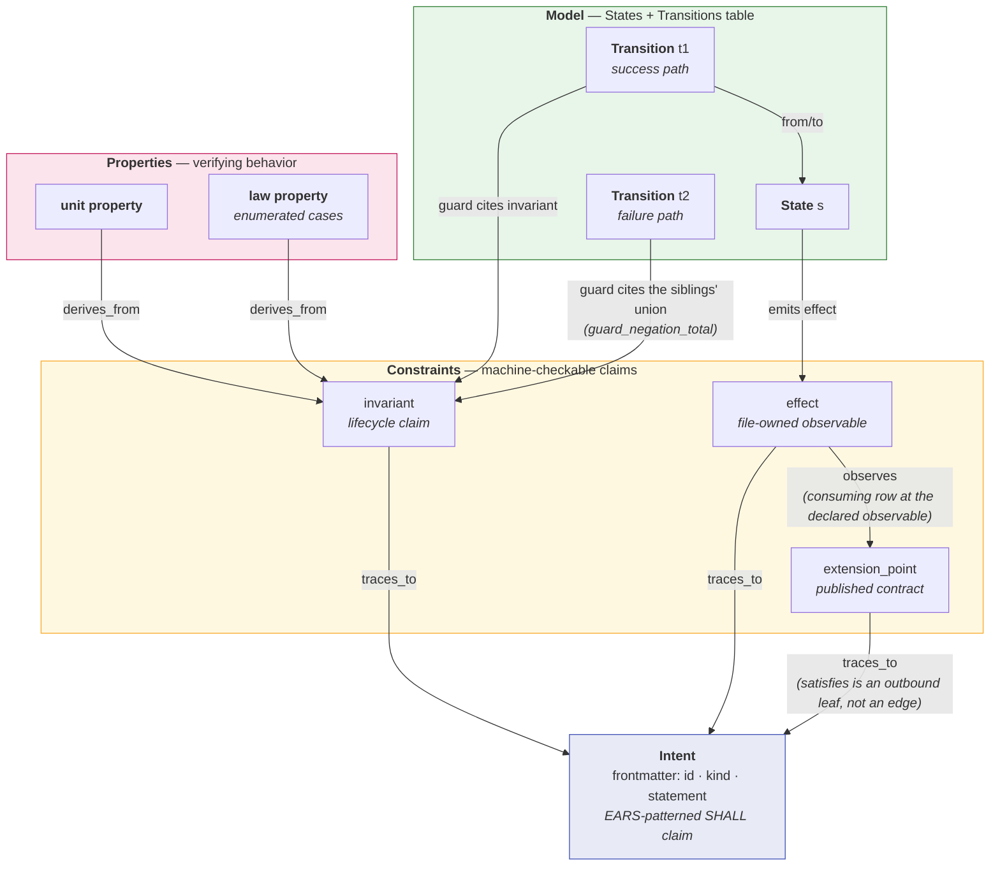
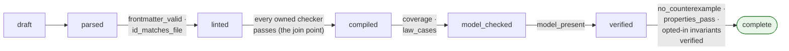

# Architecture — the four layers and the lint pipeline

Every static diagram on this page is **hand-authored**: it exists to explain
the format and the linter's *pass structure* — it is not a projection of a
live corpus. Where a diagram and the format disagree, the format wins:
`spk explain format`, `spk explain references`, and `spk explain lint-rules`
are the machine-generated truth these diagrams compress. The linter emits
self-describing findings and the rule catalog is generated from the same
table the binary uses, so a stale catalog here will out-argue this page.

For diagrams *derived from a live corpus at build time* — wiring, per-file
state machines, traceability, the revision-labeled typing table — see
[Graph views](graph-views.md). Never restate those by hand: the corpus
changes, and a hand-drawn view of it becomes an unconsulted claim.

## Four-layer relationship — one file, one spec

A spec file is one markdown document carrying four layers. The Intent
(YAML frontmatter) is the machine-linted top claim; Constraints are
machine-checkable claims that trace to it; the Model reads a lifecycle
whose guards cite those claims; Properties derive from Constraints and
give them their verifying behavior. The wiki-links in the table cells are
**typed foreign keys** — the rows link across layers with these
references:

Reading the diagram: `traces_to` anchors every Constraint in the intent
(`coverage`-style guarantees run the other way through `derives_from`);
a guard cites an `invariant` Constraint or a State (the "has reached
state X" pattern); a state's `emits` cites only `effect` Constraints;
`observes` points from a consuming row at an effect Constraint — a
declared observable. The full typing table (which field may appear on
which row kind, and what it must resolve to) is served by
`spk explain references`, and the resolution rules for file-qualified
`[[<file-id>.<row-id>]]` links (file-id-namespaced) live there too. The
`coverage` guarantee is mandatory: every Constraint needs a deriving
Property (`linter.coverage`), and every Property must derive from at
least one Constraint (`linter.no_orphan_property`) — that bidirectional
floor is what keeps the four layers one spec, not four documents.

For the *same* four layers rendered from a live corpus, see the
[state-machine view](graph-views.md#per-file-state-machines) in Graph
views — never restate it here.

## Lint checker pipeline — families and the advisory/gating split

The linter's pass structure is a join point, not a dependency DAG: each
checker family reads the structured layers (frontmatter, table rows, the
model, the corpus graph) independently, and findings accumulate until
`lint` emits. There is no machine-readable family-dependency order served
by `spk explain lint-rules`, so the diagram below is deliberately a
**layered pipeline**, not an invented dependency DAG — checker families
are grouped by what they read, and the advisory/gating distinction is
marked on the rules that carry it. The rule catalog is generated from the
same table the binary uses; the 34 rule ids served by
`spk explain lint-rules` are the authoritative enumeration. One
stated dependency exists: the failure-shape checker rides the
orchestrator's lint stage "dependent on `linter.model_shape`" — its walk
reads the Model's states, transitions and emits edges, so it runs only
once the model is proven well-formed (`dependency_respecting_skip`,
specs/linter-failure_shape.md).

Three rules are **advisory**: `linter.observability` and
`linter.skew_advisory` warn on the warnings channel with exit 0, and
`linter.single_root_reachable` is tiered — its cross-file-only half warns
(rows with no path to ANY intent still hard-fail). Every other rule in
the catalog gates: exit 1, and the lint pass fails.

```mermaid
flowchart TB
    TARGET["<b>Corpus</b><br>one spec file is one spec — structured fields only"]

    subgraph FMF ["<b>frontmatter family</b> — reads the intent layer"]
        R1["linter.frontmatter_valid<br>linter.id_matches_file<br>linter.unique_id<br>linter.no_conjoined_id<br>linter.no_universal_in_id<br>linter.ears_syntax"]
    end
    subgraph SHAPE ["<b>shape families</b> — read the rows"]
        R2["<b>schema_shape</b><br>linter.model_present<br>linter.constraint_kind_closed<br>linter.property_kind_closed<br>linter.schema_matches_typing_table"]
        R3["<b>graph_shape</b> — reads the model's edges<br>linter.guard_required<br>linter.no_self_ref<br>linter.acyclic"]
    end
    subgraph MODEL ["<b>model family</b> — reads the Model section"]
        R4["linter.every_state_used<br>linter.every_transition_valid"]
    end
    subgraph REACH ["<b>reachability family</b> — reads the linkage graph"]
        R5["linter.single_root_reachable<br><i>tiered: cross-file-only rows</i><br><i>warn (exit 0); no path to ANY intent</i><br><i>hard-fails</i>"]
    end
    subgraph INT ["<b>integrity family</b> — reads the corpus graph"]
        R6["linter.total_refs<br>linter.coverage<br>linter.no_orphan_property<br>linter.law_cases"]
    end
    subgraph DUAL ["<b>dual-format family</b> — reads the openspec mirror"]
        R7["linter.requirement_drift<br>linter.dual_format_valid"]
    end
    subgraph FAIL ["<b>failure-shape family</b>"]
        R8["linter.terminal_states_emit<br>linter.error_labels_unique<br>linter.guard_negation_total"]
    end
    subgraph CHECK ["<b>external-completeness family</b> — reads the checklist"]
        R9["linter.checklist_well_formed<br>linter.every_item_accounted<br>linter.covered_maps_resolve<br>linter.waiver_has_rationale<br>linter.no_duplicate_claim"]
    end
    subgraph PACK ["<b>pack family</b> — reads kind: profile files"]
        R10["linter.pack_shape<br>linter.orphan_vocabulary"]
    end

    ADV1["<b>linter.observability</b><br><i>advisory — warnings channel, exit 0</i>"]
    ADV2["<b>linter.skew_advisory</b><br><i>advisory — warnings channel, exit 0</i>"]

    TARGET --> FMF
    TARGET --> SHAPE
    TARGET --> MODEL
    TARGET --> REACH
    TARGET --> INT
    TARGET --> DUAL
    TARGET --> FAIL
    TARGET --> CHECK
    TARGET --> PACK

    MODEL -. "stated dependency:<br>failure_shape runs only once<br>the model is well-formed" .-> FAIL

    R1 & R2 & R3 & R4 & REACH & R6 & R7 & R8 & R9 & R10 --> JOIN{{"<b>lint</b> — the join point<br><i>all gating rules pass, or exit 1</i>"}}
    R5 -- "warn-half<br><i>(exit 0)</i>" --> JOIN
    ADV1 --> JOIN
    ADV2 --> JOIN

    style JOIN fill:#e3f2fd,stroke:#1565c0
    style R5 fill:#fff3e0,stroke:#ef6c00
    style ADV1 fill:#fff3e0,stroke:#ef6c00
    style ADV2 fill:#fff3e0,stroke:#ef6c00
```

Reading the diagram: the families are *join-point* checkers, not a
dependency DAG — the linter's actual pass structure accumulates
findings per family and emits at the join point, so no invented edges
between families — the one dashed edge below is the dependency the
failure-shape spec itself declares. Only the orange boxes are advisory; every other rule
in the catalog gates (exit 1). The per-rule semantics (one line each,
generated from the same table the binary uses) are served by
`spk explain lint-rules`, and the per-family spec files live under the
[Lint Rules](SUMMARY.md#lint-rules) section. Dogfood: `just lint-specs`
runs this linter over the corpus itself.

## Verify workflow — the canonical lifecycle

The artifact lifecycle is the pipeline's own Model, declared and
machine-linted like any other spec's. Stage gates are enforced by the
guards the lifecycle spec itself declares:

Reading the diagram: `verify` is bounded model checking of the claims
the spec **opts into** — prose-only invariants stay explicitly unchecked
and are never counted as verified. Verification is not a substitute for
the application's own test suite. The lifecycle's guards carry rule ids
served by `spk explain lifecycle`; the stage gates are enforced by the
linter's guard rules, and the `guard_required` rule makes every
transition's guard non-null. The same lifecycle is what the linter's
own Model section declares — the pipeline self-hosts. Full recipes for
running the pipeline by hand are in [Command Reference](commands.md).
